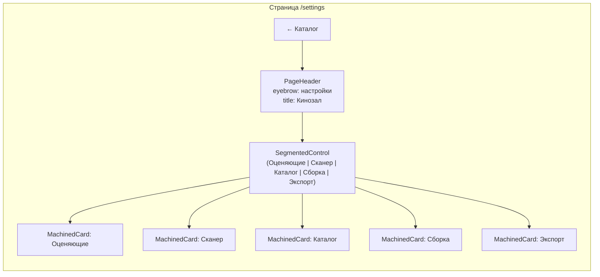

# Settings page — визуальная спецификация

Детальное описание визуала для реализатора. Следовать существующей дизайн-системе **Cinematic Tech** (ADR-0004). Токены в `src/app/globals.css`, правила в `.cursor/rules/04-nextjs-ui.mdc`. Не вводить новых токенов, шрифтов, эффектов.

## Переиспользуемые компоненты (НЕ создавать новые)

| Компонент | Путь | Где применить |
|-----------|------|---------------|
| `EntityEditLayout` | `components/layout/EntityEditLayout.tsx` | Каркас: BackLink + PageHeader (без `fillViewport`) |
| `PageHeader` | `components/primitives/PageHeader.tsx` | eyebrow (neural-pulse dot + mono-tech gold) + display title + subtitle |
| `BackLink` | `components/primitives/BackLink.tsx` | «← Каталог» |
| `MachinedCard` | `components/primitives/MachinedCard.tsx` | variant="machined" (double-bezel) для каждой секции |
| `CardSectionHeader` | `components/primitives/MachinedCard.tsx` | mono-tech gold label + display title внутри карточки |
| `Field` | `components/primitives/Field.tsx` | variant="filled" для number, variant="underline" для имён raters |
| `Button` | `components/primitives/Button.tsx` | primary (gold), ghost, danger |
| `Modal` / `ConfirmDialog` | `components/primitives/Modal.tsx` | Подтверждение удаления rater'а с оценками |
| `Select` | `components/primitives/Select.tsx` | enum-настройки (defaultSort, bitrates) |
| `SegmentedControl` | `components/primitives/SegmentedControl.tsx` | Табы секций |
| `FolderPathField` | `components/shared/FolderPathField.tsx` | scanRoot, exportTargetDir (с кнопкой «Обзор») |
| `StarRating` | `components/primitives/StarRating.tsx` | Per-rater оценки на странице фильма |
| `HoverTooltip` | `components/primitives/HoverTooltip.tsx` | Per-rater оценки в каталоге |
| `EmptyState` | `components/primitives/EmptyState.tsx` | Empty raters (теоретически) |
| `FormActionBar` | `components/primitives/FormActionBar.tsx` | Sticky save bar внизу |

## Токены (из `globals.css`, не хардкодить hex)

- Surfaces: `bg-bg-deep` `#0b0a0f`, `bg-bg-elevated` `#1a1822`, `bg-bg-surface` (glass), `bg-bg-glass` (premium)
- Borders: `border-border` (hairline), `border-border-strong`, `border-border-neural`
- Text: `text-text` (primary), `text-muted`, `text-faint`
- Accents: `text-accent` / `bg-accent` (gold `#e8b05a` — primary), `text-neural` (violet), `text-cyan` (laser/scan), `text-crimson` (ruby tier ONLY), `text-ember` (warm), `text-danger` (ошибки)
- Radius: `rounded-[var(--radius)]` (16px), `rounded-[var(--radius-sm)]` (10px), `rounded-[var(--radius-pill)]` (999px)
- Ease: `--ease` cubic-bezier(0.16,1,0.3,1)
- Glow: явные классы `.glow-accent-{8..48}`, `.glow-neural-*`, `.glow-inset-hairline-acc`

## Шрифты (из `layout.tsx`, next/font/google)

Fraunces (display, `.font-display`), Manrope (UI/body, cyrillic), JetBrains Mono (`.font-mono-tech` 0.7rem uppercase tracking, `.font-micro` 0.6rem). **НЕ Inter.**

## Эффекты (умеренно — страница настроек рабочий инструмент, не лендинг)

- `gradient-hairline` (static, на MachinedCard) — обязательно
- `sheen-layer` (на hover кнопок/карточек) — опционально
- `neural-pulse` (на eyebrow dot в PageHeader) — обязательно
- Laser/perimeter/holo — **НЕ** использовать (это для каталожных карточек и тир-страниц)
- `prefers-reduced-motion: reduce` — глобальный блок в `globals.css` гасит всё; новые анимации работают через тот же механизм

## Текст (русский UI, без длинного тире `—`, без слова «рецепт»)

«Настройки», «Оценяющие», «Сканер», «Каталог», «Сборка», «Экспорт», «Сохранить», «Сбросить», «Добавить оценяющего», «Удалить», «Обзор», «Фильмов на странице», «Сортировка по умолчанию», «Параллельных транскодов», «Битрейт AC-3», «Битрейт E-AC-3», «Корневая папка», «Папка экспорта».

---

## 1. Шапка сайта (`SiteHeader`)

Добавить пункт «Настройки» в `NAV_ITEMS` в `src/components/layout/SiteHeader.tsx`:

```typescript
const NAV_ITEMS = [
  { href: "/", label: "Каталог" },
  { href: "/franchises", label: "Франшизы" },
  { href: "/builds", label: "Сборки" },
  { href: "/settings", label: "Настройки" },  // новый
] as const;
```

Активное состояние: `pathname === "/settings"` (через существующий `isActive`). Иконка не нужна — text-only как у остальных пунктов. Существующий разделитель `|` между logo и nav остаётся.

---

## 2. Страница `/settings` — общая компоновка



**Файлы:**
- `src/app/settings/page.tsx` (RSC) — `getSettings()` + `listRaters()`, рендерит `SettingsPageClient` с initial data
- `src/app/settings/SettingsPageClient.tsx` (`"use client"`) — state, tabs, save

**Каркас (RSC):**

```tsx
<div className="space-y-6 lg:space-y-8">
  <BackLink href="/">← Каталог</BackLink>
  <PageHeader
    eyebrow="настройки"
    title={<span className="font-display">Кинозал</span>}
    subtitle="Параметры каталога, сканера, сборок и оценяющих"
  />
  <SettingsPageClient initialSettings={...} initialRaters={...} />
</div>
```

**Tabs (`SegmentedControl`):** 5 секций — «Оценяющие», «Сканер», «Каталог», «Сборка», «Экспорт». Активный таб: `bg-accent text-bg-deep shadow-[0_0_16px_var(--accent-glow)]`. Неактивный: `text-muted hover:text-text`. Иконки опциональны (lucide-react `h-3.5 w-3.5`, gap-1.5): `Users` (Оценяющие), `FolderOpen` (Сканер), `LayoutGrid` (Каталог), `Cpu` (Сборка), `HardDriveDownload` (Экспорт).

**Контент таба:** один `MachinedCard variant="machined"` с `CardSectionHeader` (label = mono-tech gold eyebrow секции, title = display заголовок) + тело. Между табом и карточкой `gap-4`. Карточка **не** `overflow-hidden` (чтобы Select-дропдауны не обрезались — учтено в `MachinedCard`).

**Save bar (sticky внизу):** `surface-glass` + `rounded-[var(--radius-pill)]` + `border-border-strong` + `backdrop-blur-xl`, кнопки primary «Сохранить» (gold) + ghost «Сбросить». Показывать только когда есть unsaved changes (state dirty). Анимация входа: `detail-reveal` из `globals.css`.

---

## 3. Секция «Оценяющие» (Raters) — главная, по умолчанию

**CardSectionHeader:** label «оценяющие» (mono-tech gold), title «Кто оценивает фильмы» (display).

**Тело:** список raters вертикально. Каждый rater — строка:

```
[drag handle] [имя rater — Field underline] [sortOrder badge] [rename btn] [delete btn]
```

Класс строки: `div className="flex items-center gap-3 rounded-[var(--radius-sm)] border border-border bg-bg-elevated/40 px-3 py-2.5 transition-colors hover:border-border-strong hover:bg-bg-elevated/70"`

- **Drag handle:** `GripVertical` lucide `h-4 w-4 text-faint hover:text-accent cursor-grab active:cursor-grabbing`. Drag-to-reorder (HTML5 drag или `@dnd-kit` если зависимость есть; иначе up/down кнопки). Reorder → `POST /api/raters/reorder`
- **Имя rater:** `Field variant="underline"` (transparent input + `UnderlineLines`), `font-display text-base`, placeholder «Имя оценяющего». На blur — `PATCH /api/raters/[id]` с debounce
- **sortOrder badge:** `font-mono-tech text-[0.6rem] text-faint` — номер (1, 2, 3...), не редактируется
- **Rename button:** `Button variant="ghost"` icon-only, `Pencil` lucide `h-3.5 w-3.5`, `aria-label="Переименовать"`, tooltip
- **Delete button:** `Button variant="ghost"` icon-only, `Trash2` lucide `h-3.5 w-3.5 text-muted hover:text-danger`, `aria-label="Удалить"`. При клике — `ConfirmDialog`

**Кнопка «Добавить оценяющего»:** внизу списка, `Button variant="ghost"` + `Plus` lucide icon + текст «Добавить». При клике — новая пустая строка с пустым `Field`, autofocus. Создание на blur или Enter → `POST /api/raters`.

**ConfirmDialog удаления (если у rater'а есть оценки):**
- Заголовок: «Удалить оценяющего?»
- Тело: «У <name> есть N оценок фильмов. Удаление сотрёт все его оценки. Действие необратимо.»
- Кнопки: «Отмена» (ghost) + «Удалить» (danger, `text-danger border-danger/50 hover:bg-danger/10`)
- Если у rater'а 0 оценок — подтверждение не нужно, удалить сразу
- Запрет: если последний rater — кнопка delete disabled, tooltip «Нужен хотя бы один оценяющий»

**Empty state (нет raters — невозможно, но на всякий):** `EmptyState` primitive с иконкой `Users` + текст «Оценяющих нет. Добавьте первого.» + кнопка «Добавить».

**Validation:** имя не пустое, макс 50 символов, уникальность (case-insensitive). Ошибка: `text-danger` под полем, `aria-invalid`, `role="alert"`.

---

## 4. Секция «Сканер»

**CardSectionHeader:** label «сканер», title «Корневая папка сканирования».

**Тело:** один `FolderPathField variant="field"` с label «Корневая папка» + кнопкой «Обзор». Под полем — helper text `font-micro text-faint`: «Фильмы в этой папке и подпапках сканируются. Системные папки (начинающиеся с точки) пропускаются.»

Сохранение: на blur или кнопкой «Сохранить» → `PUT /api/settings { scanRoot }` (или переиспользовать `PUT /api/scan`).

---

## 5. Секция «Каталог»

**CardSectionHeader:** label «каталог», title «Параметры списка фильмов».

**Тело:** два поля в `div className="flex flex-col gap-5"`:

1. **Размер страницы** — `Field variant="filled" type="number"` min=10 max=100 step=10, label «Фильмов на странице», helper text `font-micro text-faint`: «От 10 до 100. Применяется при входе в каталог.»
2. **Сортировка по умолчанию** — `Select` с options:
   - «По дате загрузки (новые сначала)» (`fileDownloadedAt desc`)
   - «По дате загрузки (старые сначала)» (`fileDownloadedAt asc`)
   - «По оценке (высокая сначала)» (`rating desc`)
   - «По названию (А→Я)» (`title asc`)
   - «По году (новые сначала)» (`year desc`)
   - «По дате создания (новые сначала)» (`createdAt desc`)
   - «По дате просмотра (недавние)» (`watchedAt desc`)

   Label «Сортировка по умолчанию», helper text: «Применяется когда в URL нет параметра sort».

Сохранение: общая кнопка «Сохранить» в save bar.

---

## 6. Секция «Сборка»

**CardSectionHeader:** label «сборка», title «Параметры сборки MKV».

**Тело:** три поля в `div className="flex flex-col gap-5"`:

1. **Параллельных транскодов** — `Field type="number"` min=1 max=8, label «Параллельных транскодов», helper text: «Сколько ffmpeg могут работать одновременно. Copy-only сборки не ограничены. Применяется к новым сборкам без перезапуска worker.»
2. **Битрейт AC-3** — `Select` с options из `AC3_BITRATES` (массив в `build-presets.ts`): 192, 224, 384, 448, 640, 768. Label «Битрейт AC-3 по умолчанию», helper text: «Для новых сборок с транскодом в AC-3.»
3. **Битрейт E-AC-3** — `Select` с options из `EAC3_BITRATES`: 384, 448, 640, 768, 1024, 1536, 2048. Label «Битрейт E-AC-3 по умолчанию».

---

## 7. Секция «Экспорт»

**CardSectionHeader:** label «экспорт», title «Папка для экспорта на TV».

**Тело:** один `FolderPathField variant="field"` с label «Папка экспорта» + кнопкой «Обзор». Helper text: «Релизы копируются сюда при экспорте на TV. Папка также выбирается в диалоге экспорта — это значение по умолчанию.»

---

## 8. Состояния (для всех секций)

- **Loading (initial):** скелетон `MachinedCard` с shimmer-плейсхолдерами строк (3-4 строки raters или 2 поля). Использовать `animate-pulse` на `bg-bg-surface` блоках.
- **Saving:** кнопка «Сохранить» → `LoaderCircle` icon `animate-spin` + текст «сохранение…» `font-mono-tech text-xs text-faint` (как в `MovieRating`).
- **Error:** `text-danger` под полем + `role="alert"`, кнопка остаётся enabled для retry. Тосты НЕ использовать (это не transient).
- **Success:** после save — мягкий fade на 200ms `text-success` «сохранено» под save bar, затем fade out. Без тостов.
- **Dirty indicator:** когда есть unsaved changes — точка `neural-pulse h-1.5 w-1.5 rounded-full bg-neural-bright` рядом с названием таба или в save bar.

---

## 9. Multi-rater UI на странице фильма (`/movies/[slug]`)

### `MovieRatingWatchedSection.tsx` — переписать

Текущая структура: «оценка» (один StarRating) + «просмотрен» (дата). Новая структура:

```
оценка и просмотр
─────────────────
Оценки (заголовок, font-mono-tech text-muted)
  [имя rater 1]  ★★★★★★★★★ 8/10    [StarRating]
  [имя rater 2]  ★★★★★★★★★★★ 10/10  [StarRating]
  ─────────────
  Средняя: 9.0  (font-display text-2xl text-accent, с glow)

просмотрен (font-mono-tech text-muted)
  15 августа 2026  (font-mono text-xl text-text)
  2 дня назад     (font-mono-tech text-accent/80)
```

**Структура JSX:**

```tsx
<section className="border-t border-border/60 pt-4">
  <h2 className="font-mono-tech mb-3 text-muted">оценка и просмотр</h2>
  <div className="flex flex-col gap-4">
    {/* Оценки */}
    <div className="flex flex-col gap-2">
      <span className="font-mono-tech text-faint">оценки</span>
      <div className="flex flex-col gap-3">
        {raters.map(rater => (
          <div key={rater.id} className="flex items-center gap-3">
            <span className="font-mono-tech w-24 shrink-0 text-[0.7rem] text-muted">
              {rater.name}
            </span>
            <MovieRating
              movieId={movieId}
              raterId={rater.id}
              value={ratings[rater.id] ?? null}
            />
          </div>
        ))}
      </div>
      {/* Средняя */}
      {averageRating != null && (
        <div className="flex items-baseline gap-2 border-t border-border/60 pt-3">
          <span className="font-mono-tech text-faint">средняя</span>
          <span
            className="font-display text-2xl font-bold text-accent"
            style={{ textShadow: "0 0 28px var(--accent-glow)" }}
          >
            {averageRating.toFixed(1)}
          </span>
          <span className="font-mono text-sm text-muted">/ 10</span>
        </div>
      )}
    </div>
    {/* Просмотрен — без изменений */}
    <div className="flex flex-col gap-2 border-t border-border/60 pt-4">
      <span className="font-mono-tech text-faint">просмотрен</span>
      {/* существующий блок watchedAt */}
    </div>
  </div>
</section>
```

### `MovieRating.tsx` — переписать

Поддерживает per-rater оценку. Props: `movieId`, `raterId`, `value`. Вызов `POST/DELETE /api/movies/[id]/ratings`. Просмотрен = есть оценка или `watchedAt`; оценка не меняет `watchedAt`.

`StarRating` остаётся как есть (10 звёзд, gold fill). Размер `size="sm"` (компактнее, т.к. теперь несколько строк).

---

## 10. Multi-rater UI в каталоге (`MovieCard.tsx`)

Текущий бейдж: один в правом верхнем углу обложки — `font-mono-tech inline-flex items-center gap-1 rounded-full border border-accent/50 bg-bg-deep/90 px-2 py-[3px] text-[0.62rem] font-semibold tabular-nums text-accent-bright` + число + `Star` icon `h-2.5 w-2.5 fill-accent`.

Новый подход (по решению пользователя): per-rater бейджи с именем + средняя в заголовке карточки.

### Заголовок карточки (где title фильма) — средняя оценка

Рядом с названием фильма (или под ним, в зависимости от существующего layout) — prominent бейдж средней:

```tsx
{averageRating != null && (
  <span
    className="font-display text-base font-bold text-accent"
    style={{ textShadow: "0 0 16px var(--accent-glow)" }}
    aria-label={`Средняя оценка ${averageRating.toFixed(1)} из 10`}
  >
    {averageRating.toFixed(1)}
    <Star className="ml-1 inline h-3 w-3 fill-accent text-accent" aria-hidden />
  </span>
)}
```

### Угол обложки — per-rater бейджи

Вместо одного бейджа — столбик мини-бейджей (по числу raters с оценками), каждый с именем:

```tsx
<div className="absolute inset-x-0 top-0 z-10 flex flex-col items-end gap-1 p-2">
  {ratedRaters.map(({ rater, rating }) => (
    <span
      key={rater.id}
      className="font-mono-tech inline-flex items-center gap-1 rounded-full border border-accent/40 bg-bg-deep/90 px-1.5 py-[2px] text-[0.55rem] tabular-nums text-accent-bright"
      aria-label={`${rater.name}: ${rating} из 10`}
      title={`${rater.name}: ${rating} из 10`}
    >
      <span className="max-w-[60px] truncate text-faint">{rater.name}</span>
      <span className="font-semibold text-accent-bright">{rating}</span>
      <Star className="h-2 w-2 fill-accent text-accent" aria-hidden />
    </span>
  ))}
</div>
```

Если raters > 2 и место ограничено — показывать первые 2 + `HoverTooltip` с остальными («+N ещё»). Имена в бейдже truncate (`max-w-[60px] truncate`).

Если ни один rater не оценил — бейджей нет (как сейчас `rating == null`).

### Загрузка данных

`movieInclude` расширить: `movieRatings { include: { rater: true }, orderBy: { rater: { sortOrder: 'asc' } } }`. В `MovieCard` props приходят `movieRatings` массив. Средняя = `computeAverageRating(movieRatings)` на лету.

---

## 11. Multi-rater в других местах

### `FranchiseSlotTooltip.tsx`

Текущее: `{slot.rating/10}`. Новое: per-rater оценки + средняя.

```tsx
<div className="flex flex-col gap-1">
  {ratedRaters.map(({ rater, rating }) => (
    <div key={rater.id} className="flex items-center gap-2">
      <span className="font-mono-tech text-[0.6rem] text-faint">{rater.name}</span>
      <span className="font-mono text-xs text-accent">{rating}/10</span>
    </div>
  ))}
  {averageRating != null && (
    <div className="mt-1 border-t border-border/60 pt-1 flex items-baseline gap-1">
      <span className="font-mono-tech text-[0.6rem] text-faint">средняя</span>
      <span className="font-mono text-sm font-bold text-accent">{averageRating.toFixed(1)}</span>
    </div>
  )}
</div>
```

### `MergeMoviesModal.tsx`

При конфликте (оба фильма имеют оценку одного rater) — per-rater выбор canonical/other. UI: для каждого конфликтного rater строка с двумя опциями (canonical / other) через `SegmentedControl` или radio.

### `FranchiseCard.tsx`, `FranchiseDetailHero.tsx`

`averageRating` — `computeAverageRating` из `movieRatings` слота. Per-rater детали на карточке франшизы не показываются.

---

## 12. Accessibility (WCAG AA, обязательные пункты)

- **Контраст:** все тексты ≥ 4.5:1 (body) / 3:1 (large). `text-faint` на `bg-bg-elevated` проверить. `text-muted` на `bg-bg-surface` проверить.
- **Focus ring:** все интерактивные элементы через `.focus-ring` (gold outline 2px offset 2px). Не убирать.
- **Keyboard nav:** Tab order = visual order. Drag-to-reorder должен иметь keyboard alternative (up/down кнопки или arrow keys). ConfirmDialog закрывается Esc.
- **aria-labels:** icon-only кнопки (rename, delete, drag) — `aria-label` обязателен. StarRating — `aria-label="Оценка фильма"` (существующий).
- **Form labels:** каждый `Field` имеет `label` (не placeholder-only). `Select` — `aria-label` или связанный `label`.
- **Error announcement:** `role="alert"` на error тексте, `aria-invalid` на поле.
- **Touch targets:** min 44×44px. Иконки-кнопки `h-3.5 w-3.5` в контейнере `min-h-9 p-2` (как в существующих ghost кнопках).
- **Reduced motion:** все анимации (neural-pulse, detail-reveal, sheen) гасятся глобальным `@media (prefers-reduced-motion: reduce)` в `globals.css`. Новых keyframes не добавлять без проверки этого блока.

---

## 13. Motion (умеренно)

- **Page entry:** `detail-reveal` на PageHeader + tabs + первой карточке (staggered `detail-reveal--2`, `detail-reveal--3`).
- **Tab switch:** crossfade контента карточки (opacity + translateY 8px, 200ms `--ease`). Не slide.
- **Save bar appearance:** `detail-reveal` когда появляется (dirty state).
- **Rater row hover:** `transition-colors duration-200` на border/bg (без scale, без layout shift).
- **StarRating hover:** существующий preview (gold/70 на hover, gold на rest).
- **Drag-to-reorder:** плавный, без скачков. На drop — `transition` на sortOrder badge.
- **ConfirmDialog:** существующая `confirm-in` анимация (0.18s `--ease`).

**Не анимировать:** появление бейджей в каталоге (они часть карточки), среднюю оценку (просто число), helper texts.

---

## 14. Иконки (lucide-react, единый стиль)

| Действие | Иконка | Размер |
|----------|--------|--------|
| Drag handle | `GripVertical` | `h-4 w-4` |
| Rename | `Pencil` | `h-3.5 w-3.5` |
| Delete | `Trash2` | `h-3.5 w-3.5` |
| Add rater | `Plus` | `h-4 w-4` |
| Browse folder | `FolderOpen` | `h-3.5 w-3.5` (существующий) |
| Tab: Оценяющие | `Users` | `h-3.5 w-3.5` |
| Tab: Сканер | `FolderOpen` | `h-3.5 w-3.5` |
| Tab: Каталог | `LayoutGrid` | `h-3.5 w-3.5` |
| Tab: Сборка | `Cpu` | `h-3.5 w-3.5` |
| Tab: Экспорт | `HardDriveDownload` | `h-3.5 w-3.5` |
| Rating star | `Star` | `h-2.5 w-2.5` (бейдж), `h-3.5 w-3.5` (StarRating sm) |
| Saving spinner | `LoaderCircle` | `h-3.5 w-3.5 animate-spin` |

Stroke width единый (lucide default `2`). НЕ смешивать с другим icon set.

---

## 15. Чек-лист перед сдачей (для реализатора)

- [ ] Шапка: «Настройки» в `SiteHeader` добавлена, активное состояние работает
- [ ] Каркас: `EntityEditLayout` (без `fillViewport`) + `PageHeader` с eyebrow «настройки»
- [ ] Tabs: `SegmentedControl` с 5 секциями, «Оценяющие» по умолчанию
- [ ] Каждая секция: `MachinedCard variant="machined"` + `CardSectionHeader`
- [ ] Оценяющие: список строк с drag/rename/delete, кнопка «Добавить», ConfirmDialog на удаление с оценками
- [ ] Сканер: `FolderPathField` для scanRoot
- [ ] Каталог: number Field для pageSize + Select для defaultSort
- [ ] Сборка: number Field для concurrency + 2 Select для bitrates
- [ ] Экспорт: `FolderPathField` для exportTargetDir
- [ ] Save bar: sticky, только при dirty state, кнопки «Сохранить»/«Сбросить»
- [ ] Состояния: loading skeleton, saving spinner, error inline, success fade
- [ ] Multi-rater на странице фильма: per-rater StarRating + средняя
- [ ] Multi-rater в каталоге: per-rater бейджи в углу + средняя в заголовке
- [ ] FranchiseSlotTooltip: per-rater оценки + средняя
- [ ] MergeMoviesModal: per-rater выбор canonical/other
- [ ] Accessibility: focus ring, keyboard nav, aria-labels, touch targets ≥44px
- [ ] Reduced motion: все анимации гасятся через существующий global block
- [ ] Токены: не хардкодить hex, использовать `bg-bg-*` / `text-*` / `border-*`
- [ ] Шрифты: `.font-display` / `.font-mono-tech` / `.font-micro`, НЕ Inter
- [ ] Текст: русский, без длинного тире `—`, без слова «рецепт»
- [ ] Иконки: lucide-react, единый stroke width
